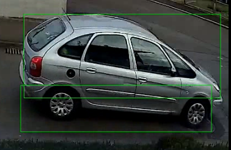

# rtsp-motion

The script allows automatic recording of motion of an rtsp camera.

Option 1)   `--record_computer_side_motion` captures the video of rtsp camera, analyzes it for motion and records it as a picture+video

Option 2) `--record_camera_side_motion` if the camera is a foscam, i.e. provides camera-side motion detection, it can monitor that motion-API flag and record only then (much lighter on CPU).

Additional features:

* It can send an email alert with the recorded picture+video   (`--enable_mailer`)
* Option 1 actually can save the recording *before* the motion has happened
* If the camera disconnects for some reason, the script retries connecting forever
* It automatically draws green boxes around the detected movement  (works best with `--record_computer_side_motion` )




Please fill `config.py`  with your details first. 

```
usage: main.py [-h] [--video_recording_length VIDEO_RECORDING_LENGTH]
               [--past_video_recording_length PAST_VIDEO_RECORDING_LENGTH] [--rec_folder REC_FOLDER]
               [--password PASSWORD] [--ip IP] [--username USERNAME] [--port PORT] [--mail_address MAIL_ADDRESS]
               [--smtp_server SMTP_SERVER] [--smtp_port SMTP_PORT] [--enable_sound_alarm] [--enable_mailer]
               [--record_computer_side_motion] [--record_camera_side_motion]
               [--call_camera_function CALL_CAMERA_FUNCTION [CALL_CAMERA_FUNCTION ...]]

Motion recording for rtsp cameras

optional arguments:
  -h, --help            show this help message and exit
  --video_recording_length VIDEO_RECORDING_LENGTH
                        length of videos in seconds (default: 10)
  --past_video_recording_length PAST_VIDEO_RECORDING_LENGTH
                        Record previous seconds (default: 2)
  --rec_folder REC_FOLDER
                        Recording folder (default: "/some/path")
  --password PASSWORD   rtsp password (default: password)
  --ip IP               ip of camera (default: 1.0.0.0)
  --username USERNAME   rtsp username (default: username)
  --port PORT           rtsp port (default: 88)
  --mail_address MAIL_ADDRESS
                        mail_address (default: mailaddress)
  --smtp_server SMTP_SERVER
                        smtp_server (default: smtp_server)
  --smtp_port SMTP_PORT
                        smtp port (default: 587)
  --enable_sound_alarm
  --enable_mailer
  --record_computer_side_motion
                        Gets the video stream from the camera and monitors the stream for motion
  --record_camera_side_motion
                        Uses the motion detection on the camera chip itself (support currently of Foscam models),
                        see https://www.foscam.es/descarga/Foscam-IPCamera-CGI-User-Guide-
                        AllPlatforms-2015.11.06.pdf
  --call_camera_function CALL_CAMERA_FUNCTION [CALL_CAMERA_FUNCTION ...]
                        create_video_capture, detected_motion, detected_sound, free, get_audio_alarm_config,
                        get_dev_state, get_fps, get_frame, get_image_setting, get_infrared_led,
                        get_infrared_led_config, get_log, get_main_video_stream_infos,
                        get_main_video_stream_type, get_motion_detection, get_motion_detection_config,
                        get_night_light_status, get_port_info, get_video_stream_infos,
                        get_video_stream_parameters, get_width_height, get_wifi_list, getwifi_config,
                        refresh_wifi_list, requests_command, set_audio_alarm_config, set_datetime,
                        set_infrared_led, set_infrared_led_config, set_main_video_stream_type,
                        set_motion_detection, set_night_light_status, url_cgi, url_rtsp
```


